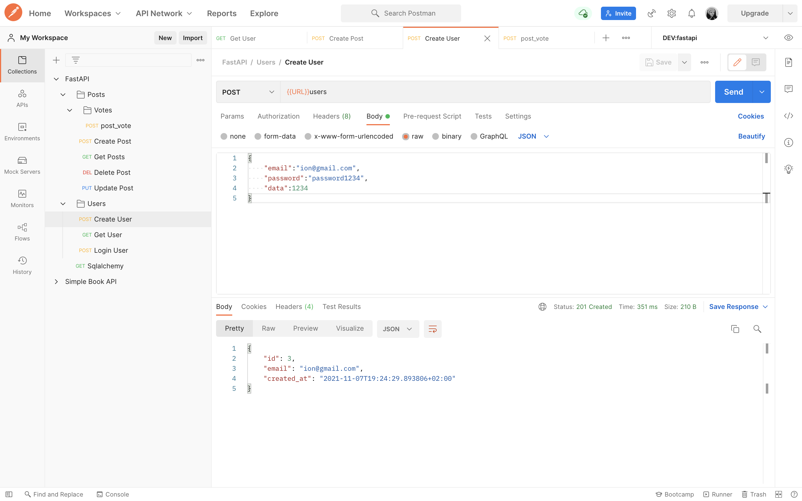
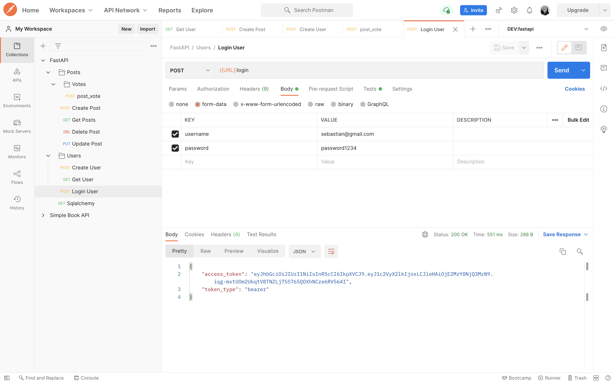

<div id="top"></div>

<!-- PROJECT LOGO -->
<br />
<div align="center">
  <a href="">
    
  </a>

  <h3 align="center">Creating my own API</h3>

  <p align="center">
    <a href="https://fastapi.tiangolo.com"><strong>Explore the docs »</strong></a>
  </p>
</div>


<!-- TABLE OF CONTENTS -->
<details>
  <summary>Table of Contents</summary>
  <ol>
    <li>
      <a href="#about-the-project">About The Project</a>
      <ul>
        <li><a href="#built-with">Built With</a></li>
      </ul>
    </li>
    <li>
      <a href="#getting-started">Getting Started</a>
      <ul>
        <li><a href="#installation">Installation</a></li>
      </ul>
    </li>
    <li><a href="#usage">Usage</a></li>
    <li><a href="#contact">Contact</a></li>
    <li><a href="#acknowledgments">Acknowledgments</a></li>
  </ol>
</details>


<!-- ABOUT THE PROJECT -->
## About The Project

I started this project with the scope of learning multiple techniques of creating, developing a Restful API. This project is about sending requests to the server and after that process them and sending the resource that the client is interested about.
Here's how:
* The client sends a request to the server
* The server verifies that the request is valid
* Gets the resources from the postgreSQL
* Renders the resources so that it sends only what the client wants 


<p align="right">(<a href="#top">back to top</a>)</p>


### Built With

This section should list any major frameworks/libraries and technologies that I used in creating this application. Here are a few examples.

* [Python(3.9.7)](https://nextjs.org/)
* [PostgreSQL](https://reactjs.org/)
* [Postman](https://vuejs.org/)

* [psycopg2(2.9.1)](https://angular.io/)
* [SQLAlchemy(1.4.26)](https://svelte.dev/)

Feel free to check out my [requirements.txt](https://github.com/GalbinitaSebastian97/API/blob/main/requirements.txt) for more libraries that I used.

<p align="right">(<a href="#top">back to top</a>)</p>


<!-- GETTING STARTED -->
## Getting Started

This is an example of how you may give instructions on setting up your project locally.
To get a local copy up and running follow these simple example steps.

### Installation

_Below is an example of how you can instruct your audience on installing and setting up your app._

1. Clone the repo
   ```sh
   git clone https://github.com/GalbinitaSebastian97/API.git
   ```
2. Install packages, see [requirements.txt](https://github.com/GalbinitaSebastian97/API/blob/main/requirements.txt)
   ```sh
   pip install <package>
   ```
3. Start the project by typing in your terminal `config.js`
   ```sh
   uvicorn app.main:app
   ```

<p align="right">(<a href="#top">back to top</a>)</p>


<!-- USAGE EXAMPLES -->
## Usage

In order to send a request, the client should be authentificated so that he can send any CRUD operations to the server. The authentification process is done by
sending the username and the password to the server, and if they are valid a token that expires after 30 mins is send back to the client.
<div align="center">
    
    
</div>

<p align="right">(<a href="#top">back to top</a>)</p>


<!-- CONTACT -->
## Contact

Galbinita Sebastian - sebastian.galbinita97@yahoo.com

Project Link: [https://github.com/your_username/repo_name](https://github.com/GalbinitaSebastian97/API)

<p align="right">(<a href="#top">back to top</a>)</p>


<!-- ACKNOWLEDGMENTS -->
## Acknowledgments

This space is for the resources that I found very helpful in creating this app!

* [FastAPI](https://fastapi.tiangolo.com)
* [PostgreSQL](https://www.postgresql.org/docs/current/)
* [Postman](https://learning.postman.com/docs/getting-started/introduction/)
* [Freecodecamp](https://www.freecodecamp.org/news/creating-apis-with-python-free-19-hour-course/)
* [Rest API Best Preactices](https://www.freecodecamp.org/news/rest-api-best-practices-rest-endpoint-design-examples/)

Last but not least I want to mention Stackoverflow community that helped me in solving the issues that I encountered during the development of my project.

<p align="right">(<a href="#top">back to top</a>)</p>

